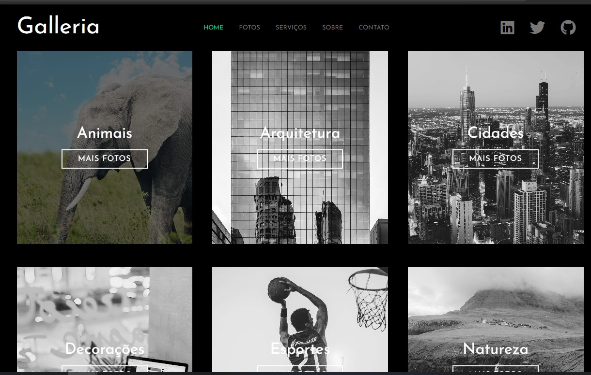

# Página de Galeria utilizando SASS




Neste projeto foi criado uma galeria de imagens (exemplo), para utilizar estilização através de SASS.
Foram utilizados variables e mixins para facilitar e automatizar a estilização e realizar de maneira simples a responsividade com media queries.


## Criar o css a partir do SASS
```sass --watch sass/styles.sass:css/styles.css```